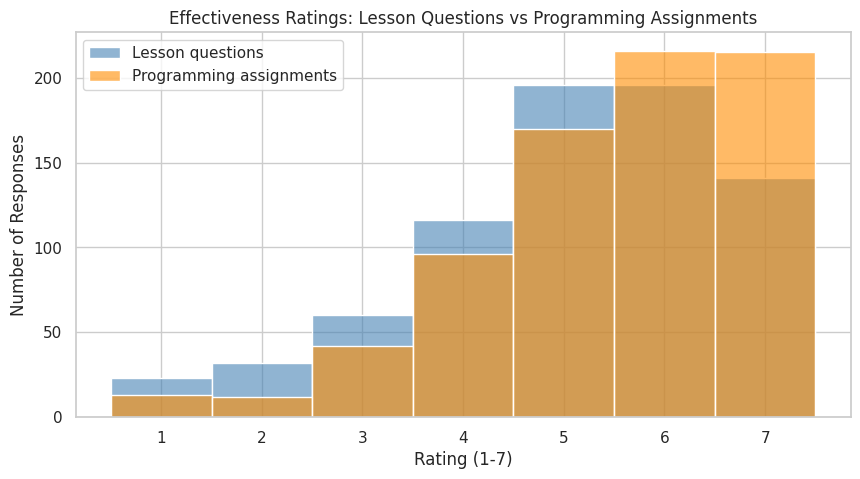
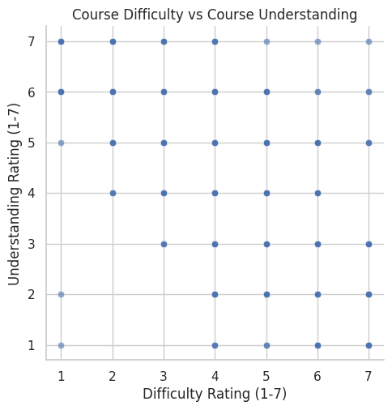

---
# Do not edit the text between these lines!
layout: default
---

# EX09 for Yewon

<!-- This is a comment. Below, you'll see code for inserting an image. To make this image appear, update <custom-path>. To add an image, save it inside the imgs folder of this repository. -->
## Summary

This course should implement GoValuate coding exercises during class because it can increase class engagement, attendance, and deepen the understanding of coding for students.

## Visualization 1

## Visualization 2

## Conclusion

I think my analysis of the data could support my idea, since it shows that coding assignments seems to benefit students and be quite effective. I think the idea about implementing GoValuate and it being effective is inconclusive though, since it's a new tool that hasn't been introduced to students yet, it's hard to tell from current data if it will be effective. I believe that doing more in-class coding practice through GoValuate or anything else can help students solidify their understanding on code and possibility be able to help them during assignments (without use of AI). GoValuate takes a lot of class time, so that could be a trade off, but it does increase in-class engagement since the practice could be a little bit more difficult and it can encourage students to ask questions to TAs and the professor if necessary. Using GoValuate as attendance can encourage students even further to come to class, stay engaged, and do their best and reach out for help if they need. 